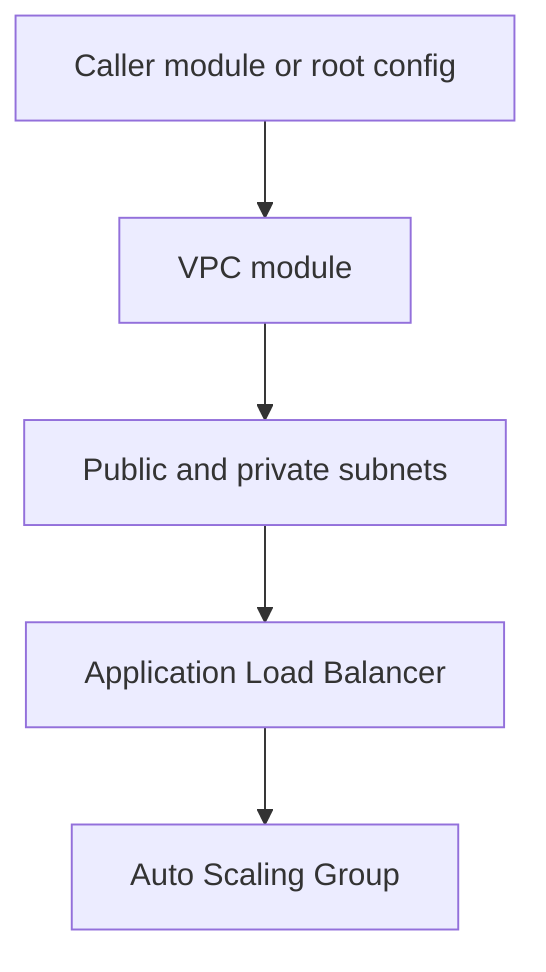

# Terraform Module Documentation Writer

When this skill is active, you generate or update `README.md` files for
Terraform modules so they meet HashiCorp's standard module structure and
documentation guidelines, as well as the team's module documentation
conventions. You work **only** from the available Terraform source files
and text context; you MUST NOT rely on external tools or CLIs like
`terraform-docs`.

This skill is designed to be portable across Linux, macOS, and Windows
by avoiding OS-specific dependencies and focusing on text analysis and
generation.

## When to use this skill

Use this skill when:

- The user asks you to create or improve documentation for a Terraform
  module (root module or nested module).
- A module directory contains Terraform files (`main.tf`,
  `variables.tf`, `outputs.tf`, etc.) but the `README.md` is missing,
  incomplete, or inconsistent.
- The user wants to standardize module docs across a library of
  modules.
- The user wants to review or refactor an existing `README.md` to match
  recommended structure and content.

Do NOT use this skill for:

- Documenting non-Terraform projects (apps, Helm charts, etc.).
- Generating provider or resource reference docs (refer the user to
  provider docs instead).
- Running `terraform` commands, linting, or CI configuration.

## Inputs and assumptions

Assume you have access to:

- The path to a Terraform module directory (root or nested module),
  which may contain:
  - `main.tf` (required by convention),
  - `variables.tf`,
  - `outputs.tf`,
  - optional additional `.tf` files,
  - an existing `README.md` (optional).
- Organizational documentation conventions (like those in
  `module_documentation.md`) when provided.

From these files you must infer:

- The module's purpose and scope.
- The public interface of the module (variables and outputs).
- Reasonable usage examples based on variables and typical patterns.

You MUST treat `variables.tf` and `outputs.tf` as the **single source
of truth** for the module interface.

## High-level behavior

At a high level, this skill:

1. Locates and inspects Terraform module files in the given directory.
2. Extracts the module interface:
   - All input variables with name, type, default (if any), and
     description.
   - All outputs with name and description.
3. Derives a concise, accurate description of:
   - What the module does.
   - When it should and should NOT be used.
   - Key assumptions and constraints.
4. Generates or updates `README.md` for the module with standard
   sections:
   - Overview / Purpose
   - Requirements
  - Resources
   - Inputs
   - Outputs
   - Usage Example(s)
   - Assumptions / Constraints
   - Versioning (if applicable)
   - Ownership / Contact
 5. Generates or updates at least one runnable Terraform example
    configuration under `examples/` (default: `examples/basic/`) that
    uses the module.
 6. Keeps documentation and examples in sync with the actual Terraform code
    by using the code as the authoritative source.
 7. Avoids external command execution (`terraform-docs`, `terraform`,
    etc.) and works purely via text analysis.

## Detailed workflow

Follow this workflow step by step. If information is missing, make
minimal, clearly-labelled assumptions and prefer asking the user to
confirm when interactive.

### Step 1: Identify module type and files

Given a target directory (for example `modules/aws-sandbox-environment-vpc`):

1. List `.tf` files in the directory.
2. Detect:
   - presence of `main.tf` (entrypoint),
   - `variables.tf`,
   - `outputs.tf`,
   - optional `versions.tf`,
   - any existing `README.md`.

Classify the module as:

- **Root module** if it is the primary module of a repo, typically in
the repository root, or the user explicitly says so.
- **Nested module** if under a `modules/` subdirectory, following
  HashiCorp’s standard module structure.

This classification shapes how you phrase Overview and examples (nested
modules are often more focused and reused by other modules).

### Step 2: Parse variables and outputs (text-based)

Without calling external tools, parse `variables.tf` and `outputs.tf` as
HCL-like text:

- For each `variable "<name>"` block, extract:
  - `name` (string after `variable`),
  - `type` (if present),
  - `default` (if present; determine if variable is required or
    optional),
  - `description` (if present, including heredocs).
- For each `output "<name>"` block, extract:
  - `name`,
  - `description` (if present).

Heuristics and rules:

- If `default` is absent, mark the variable as **Required**.
- If `description` is absent, infer a short, neutral description based
  on the name and usage (e.g., `vpc_id` → "ID of the VPC to use.").
- Retain original types and defaults exactly as written whenever
  possible.

Build internal tables like:

- Inputs: name, type, default, required, description.
- Outputs: name, description.

### Step 3: Derive module overview and scope

Inspect `main.tf` and other `.tf` files to infer:

- Primary cloud resources or services (e.g., VPC, ALB, S3 bucket).
- High-level purpose (e.g., "Create a sandbox VPC environment for
  development workloads").
- Any obvious limits (e.g., region constraints, assumptions about
  pre-existing VPC, KMS keys, IAM roles).

From this, generate a short **Overview** section that:

- States what the module does.
- States when to use it (and when not to, if applicable).
- Avoids implementation details except when critical to understanding
  behavior.

### Step 4: Build the README.md skeleton

Always generate `README.md` with this structure, unless the user or
organization specifies a slightly different template:

````markdown
# <Module name>

## Overview

<What this module does, when to use it, when not to.>

## Requirements

- Terraform >= <version>
- Providers:
  - <provider> >= <version>
  - ...

## Resources

List the Terraform resources the module may create.

| Resource Name | Resource Type | Notes |
|---------------|---------------|-------|
| ...           | ...           | ...   |

## Inputs

| Name | Type | Default | Required | Description |
|------|------|---------|----------|-------------|
| ...  | ...  | ...     | ...      | ...         |

## Outputs

| Name | Description |
|------|-------------|
| ...  | ...         |

## Usage

```hcl
module "<logical_name>" {
  source = "<module_source>"

  # Required inputs
  # ...

  # Optional inputs
  # ...
}
```

## Assumptions and Constraints

- ...

## Versioning

- This module follows semantic versioning (MAJOR.MINOR.PATCH).
- Recommended: pin the module version in `source` references.

## Ownership

- Owner: <team or contact>
- Source: <repository URL or registry address>
````

You MUST:

- Populate a `Resources` section by inspecting resource blocks across all
  `.tf` files (for example `resource "aws_vpc" "this" { ... }`).
- Include resources that are conditionally created (for example using `count`
  or `for_each`) and mark them clearly in the `Notes` column as "Conditional".
- Keep `Resources` descriptive and implementation-aware, but avoid promising
  that all listed resources are always created in every configuration.
- Fill the Inputs and Outputs tables from the parsed variables and
  outputs.
- Ensure that the Usage example is **copy-paste runnable** with minimal
  edits (for example, only requiring the user to provide obvious values
  like `vpc_id`).
- Clearly distinguish required vs optional inputs based on the presence
  of `default`.

If organizational guidelines require extra sections (e.g., "Assumptions"
or "Author / Ownership"), include them and populate from any available
context.

### Step 5: Handling existing README.md

If a `README.md` already exists:

1. Parse the existing sections.
2. Compare Inputs/Outputs tables against the extracted variables and
   outputs.
3. Update the README so that:
   - Inputs/Outputs tables match the current Terraform interface.
   - Outdated or missing variables/outputs are corrected.
   - Existing good text (overview, diagrams, rich explanations) is
     preserved when still accurate.
4. If there are conflicts between the README and the `.tf` files, treat
   the `.tf` files as authoritative and adjust the README, optionally
   adding a brief note or asking the user to confirm.

Aim to **improve** the existing README rather than rewriting it from
scratch, unless it is badly structured or obsolete.

### Step 6: Required examples and advanced usage

Examples are mandatory, not optional.

You MUST:

- Ensure an `examples/` directory exists for the module documentation scope.
- Ensure at least one complete example configuration exists that uses the
  module.
- Use `examples/basic/` as the default example path unless the caller or
  repository conventions explicitly require a different path.
- Ensure the example is minimally runnable and includes all required module
  inputs with safe placeholder/demo values.
- Ensure the README `Usage` section and the filesystem example stay aligned.

Minimum required example artifacts (for `examples/basic/`):

- `examples/basic/main.tf` with a `module` block and required provider/
  terraform configuration as needed for a valid example.
- Add supplemental files only when needed for validity (for example
  `examples/basic/variables.tf` or `examples/basic/outputs.tf`).

If multiple patterns are common (e.g., internal vs public ALB,
single-region vs multi-region), additional examples may be added, but at
least one example is always required.

README guidance for examples:

- Add a short note that the example can be validated with Terraform
  commands from the repository root.
- If the example is located in `examples/basic/`, include this exact
  command sequence:

```bash
terraform -chdir=examples/basic init ; terraform -chdir=examples/basic plan
```

- If a different example directory name is used (for example
  `examples/basics/`), adjust the `-chdir` path accordingly.

Completion gate for this step:

- Do not finalize output unless at least one example file set is produced
  under `examples/` and referenced in README.

### Step 7: Assumptions, limits, and diagrams

From the code and any provided documentation:

- Extract and list key assumptions:
  - Required external resources (VPCs, KMS keys, IAM roles).
  - Expected tags, naming conventions, or policies.
  - Tested regions/providers.
- Note important limits (e.g., "not tested in GovCloud", "assumes
  private DNS zone exists").

For complex modules (e.g., VPC, shared networking, platform services):

- Suggest or include a simple diagram in Mermaid.js syntax in the README
  to show:
  - Main resources,
  - Relationships,
  - External dependencies.
- Prefer a simple, high-level diagram (such as `flowchart` or `graph TD`)
  that can be rendered by Markdown viewers supporting Mermaid.

Example (to include in the README under a "Diagram" or "Architecture" section):



If you cannot reliably infer the full topology, generate the simplest
useful diagram and clearly note that it is a high-level approximation.

If Mermaid is not supported in the target environment, fall back to a
textual description of the architecture (for example, bullet list of
components and their relationships).

### Step 8: Versioning and ownership

If the repo or context mentions versions (tags like `v1.2.3`):

- Add a **Versioning** section describing:
  - That the module follows semantic versioning (MAJOR.MINOR.PATCH).
  - What constitutes breaking changes (e.g., changes to inputs/outputs
    or behavior).
- Recommend pinning module versions in usage examples.

Always add an **Ownership** section:

- If owner metadata is provided, use it.
- Otherwise, insert a placeholder like "Owner: `<team-name>`" and let
  the user fill it.

### Step 9: Robustness and safety practices

To maximize reliability (inspired by lessons learned from agent/skill
research):

- Be explicit about uncertainties:
  - If you infer behavior from incomplete code, state that the
    description is inferred and may need confirmation.
- Prefer **deterministic structures** (fixed section ordering, fixed
  table columns) over free-form prose.
- Avoid hidden side effects:
  - Only read and write files in the specified module directory when
    instructed by the calling agent.
  - Never execute shell commands or rely on system-specific behavior.
- Make incremental changes:
  - When updating an existing README, adjust only what’s necessary to
    align with the current module interface and guidelines.

## Output format

When the agent asks you to generate or update documentation, you should
respond with:

- The full new content of `README.md` in a Markdown code block,
  clearly marked as the desired file contents.
- The full content of at least one example Terraform file under
  `examples/` (default: `examples/basic/main.tf`) in Markdown code blocks,
  each clearly marked with target file path.
- When requested, include a diff-style summary of README and example file
  changes, plus final full file contents.

Example output structure:

````md
### Generated README.md

```markdown
# <Module name>
...
```

### Generated examples/basic/main.tf

```hcl
terraform {
  required_version = ">= 1.5.0"
}

module "example" {
  source = "../../"

  # Required inputs
  # ...

  # Optional inputs
  # ...
}
```
````

The calling agent will be responsible for actually writing files to disk.

## Examples

### Example: Create README for a new module

User context:

- Directory: `modules/aws-sandbox-environment-vpc/`
- Files: `main.tf`, `variables.tf`, `outputs.tf`, `versions.tf`
- No `README.md` yet.

You should:

1. Parse `variables.tf` and `outputs.tf` to build Inputs/Outputs tables.
2. Inspect `main.tf` to detect it creates a sandbox VPC environment for
   development.
3. Propose a `README.md` with the standard sections and a `Usage`
   example using `modules/aws-sandbox-environment-vpc` as the source.

### Example: Update README after interface change

User context:

- Existing `README.md` with Inputs/Outputs tables.
- `variables.tf` updated with new variable `enable_flow_logs`.

You should:

1. Detect that `enable_flow_logs` exists in `variables.tf` but not in
   README.
2. Add a row to the Inputs table, marking it as required/optional based
   on `default`.
3. Update any relevant Assumptions or Usage examples to mention flow
   logs if significant.
